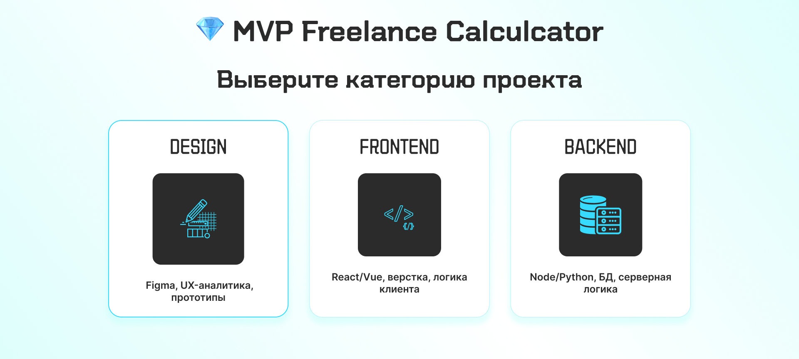

# 💎 Freelance Calculator: Калькулятор стоимости проектов для фрилансеров

[](https://github.com/DanriWeb/freelance-calculator)
[](https://react.dev/)
[](https://www.typescriptlang.org/)
[](https://vitejs.dev/)

**Freelance Calculator** — интерактивный калькулятор для расчета стоимости фриланс-проектов с учетом различных параметров и факторов.

> **ℹ️ О проекте (кратко):**
> Пет-проект для демонстрации навыков разработки на современном стеке (React + TypeScript + Vite), работы с состоянием приложения и создания адаптивного интерфейса по принципу mobile-first.
> Цель — создать удобный инструмент для фрилансеров, помогающий корректно оценивать стоимость своих услуг.

> **🎨 Дизайн:**
> Макет интерфейса разработан в Figma: [**Открыть макет**](https://www.figma.com/design/DsLhfCJT6ztEDs0tgI2sZa/%C2%ABFreelance-Calculator%C2%BB?node-id=0-1&t=Joa3dHPFiCMq2RD0-1)

---

## 📸 Превью приложения



---

## 🚀 Другие проекты

[](https://github.com/DanriWeb/novveris#readme)
[](https://github.com/DanriWeb/flight-services#readme)

---

## 📑 Навигация

- [1. Описание проекта](#1-описание-проекта)
- [2. Установка и запуск](#2-установка-и-запуск)
- [3. Архитектура проекта](#3-архитектура-проекта)
- [4. История коммитов и Conventional Commits](#4-история-коммитов-и-conventional-commits)
- [5. Технологический стек](#5-технологический-стек)
- [6. Лицензия](#6-лицензия)
- [7. Контакты](#7-контакты)

---

## 1. Описание проекта

Разработка интерактивного калькулятора для фрилансеров, позволяющего рассчитывать стоимость проектов с учетом множества факторов: сложности задачи, срочности, опыта специалиста, типа работы и других параметров.

### Цели проекта

- **Помощь фрилансерам** — корректная оценка стоимости услуг
- **Прозрачность ценообразования** — понятная формула расчета
- **Гибкость настроек** — учет индивидуальных параметров
- **Удобный интерфейс** — интуитивное управление калькулятором
- **Адаптивный дизайн** — работа на всех устройствах

---

## 2. Установка и запуск

**Предварительные требования:** Node.js v18+ и npm v9+.

**Клонирование:**

```bash
git clone https://github.com/DanriWeb/freelance-calculator.git
cd freelance-calculator
```

**Установка зависимостей:**

```bash
# npm
npm install

# yarn
yarn install

# pnpm
pnpm install
```

**Запуск приложения:**

```bash
# npm
npm run dev            # запуск в режиме разработки
npm run build          # сборка для продакшена
npm run preview        # предпросмотр продакшен-сборки

# yarn
yarn dev
yarn build
yarn preview

# pnpm
pnpm run dev
pnpm run build
pnpm run preview
```

**Проверка качества кода:**

```bash
# npm
npm run lint           # проверка кода с ESLint

# yarn
yarn lint

# pnpm
pnpm run lint
```

> 💡 **Подсказка:** После запуска `npm run dev` приложение будет доступно по адресу `http://localhost:5173`

---

## 3. Архитектура проекта

Проект использует **компонентную архитектуру** (Component-Based Architecture) с чётким разделением на слои данных, типов, хуков и UI-компонентов.

### Структура файлов

```
src/
├── assets/                   # Статические ресурсы
├── components/               # React компоненты
├── types/                    # TypeScript типы и интерфейсы
├── data/                     # Константы и конфигурация
├── App.tsx                   # Главный компонент
├── App.css                   # Стили приложения
├── index.css                 # Глобальные стили и CSS-переменные
└── main.tsx                  # Точка входа
```

---

## 4. История коммитов и Conventional Commits

**С 27 декабря 2025 года** в проекте применяется строгое соблюдение спецификации [**Conventional Commits**](https://www.conventionalcommits.org/) для демонстрации профессионального подхода к версионированию.

> **ℹ️ Примечание:** Коммиты до 27.12.2025 могут не полностью соответствовать стандарту, так как проект находился на стадии начальной разработки.

---

## 5. Технологический стек

| Технология | Версия | Назначение                   |
| ---------- | ------ | ---------------------------- |
| React      | 19.2.0 | Библиотека для построения UI |
| TypeScript | 5.9.3  | Типизированный JavaScript    |
| Vite       | 7.2.4  | Сборщик и dev-сервер         |

---

## 6. Лицензия

Этот проект распространяется под лицензией **MIT**.

---

## 7. Контакты

Я открыт для новых предложений и карьерных возможностей. Если вас заинтересовал мой опыт или у вас есть подходящая вакансия — буду рад обсудить сотрудничество.

Вы можете связаться со мной через следующие каналы:

| Канал связи     | Ссылка / ID                                                                         |
| :-------------- | :---------------------------------------------------------------------------------- |
| **Telegram**    | [**@danriweb_online**](https://t.me/danriweb_online)                                |
| **Email**       | [danri.web@gmail.com](mailto:danri.web@gmail.com)                                   |
| **HeadHunter**  | [Резюме на HeadHunter](https://hh.ru/resume/741ea29dff0f262c1c0039ed1f7730326d694e) |
| **Habr Career** | [Профиль на Хабр Карьере](https://career.habr.com/danriweb)                         |

---

**Дата создания:** 25 декабря 2025
